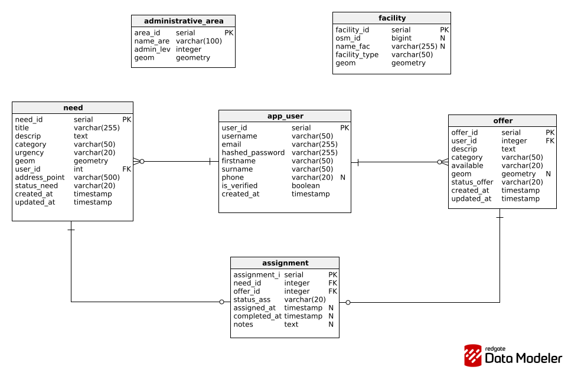

# Community Hazard Response Platform
A platform designed to coordinate community responses to local hazards and emergencies. It enables real-time reporting, resource allocation, and communication between residents, volunteers, and emergency services.

## Database Schema
The platform uses PostgreSQL with PostGIS to support geospatial data and real-time coordination of emergency needs and volunteer responses. The database models users, help requests, volunteer offers, and their assignments, enabling proximity-based matching, area filtering, and integration with external geographic data.

The schema also incorporates reference layers from OpenStreetMap, such as administrative areas and emergency facilities, to provide geographic context and support spatial queries. Spatial indexes and automated timestamp updates are used to ensure performance and data consistency.

